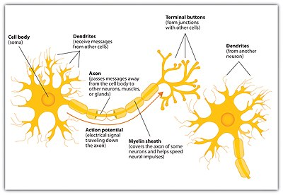
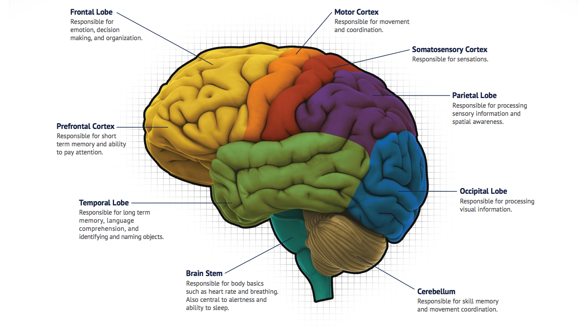
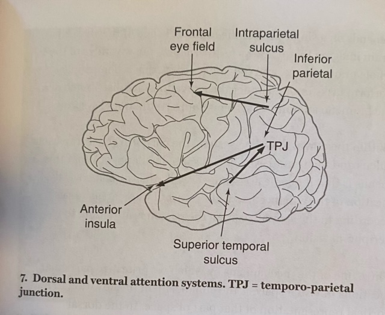
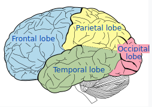

:arrow_upper_left: **Navigate conveniently using the menu button.**

# Cognitive Neuroscience Cheat Sheet
# References
* `Cognitive Neuroscience: A Very Short Introduction` by Richard Passingham
* Wikipedia
* psychology.fandom.com

# Intended Audience
* People who are curious about the brain.
* Me when I want to review Cognitive Neuroscience

# Anatomy of a Neuron

# Functional Map of the Human Brain

## Terminology
* `Dorsal`: Top surface of brain
* `Ventral`: Bottom surface of brain
* `Posterior`: Back of brain
* `Anterior`: Front of brain
* `Lesion`: A region in an organ or tissue which has suffered damage through injury or disease, such as a wound, ulcer, abscess, or tumor.
* `Salient stimuli`: Features of objects in the environment attract our attention

# Case Studies
Much of our understanding of cognitive neuroscience is from case studies where a particular human is observed to have isolated damage in a specific area of the brain. By understanding the difference in the cognition between typical and damaged brains, we can ethically understand the function of particular brain regions in humans. While this does not hold the same scientific rigor as a systematic study, it would be unethical to damage human brains for experimental purposes.

# Perception
* Two principles:
    * `Locality of function`: Processing information is parallelized by different regions of the brain.
    * `Mapping`: Each aspect about the external world can be mapped to a particular stimulus in the brain. Often the size of a brain region corresponds with the impact that it has with cognition.
* `Primary Sensory Areas`: Parts of the brain that are connected to sensory organs.
* `Secondary Sensory Areas`: Parts of the brain that take as input the output from the primary sensory areas.
* Primary sensory areas are labeled with 1, secondary areas with 2, tertiary with 3, etc.
## Visual
* `Visual areas`: V1, V2, V3, V4, ...
* `Lateral Occipital (LO) Complex`: Performs object recognition using the shape of the object
* `Ventral Visual System`: 
* `Dorsal Visual System`: Directly connects to areas in frontal lobe that controls movement. Used to guide action using vision. Carries information about the movement of objects.
* `Middle Temporal (MT) Complex`: Analyzes the movement of objects using information from the Dorsal Visual System.
* `Phosphenes`: Flashes of light originating from visual cortex.
* `V4/V8 Area`: Processes colors.

## Somatosensory Area
* S1, S2, etc.
* Involved with touch, temperature, pressure, and pain.

## Combining the Senses
* More locally, the different sensory aspects of the same sense (e.g. Vision) are combined by connections within that sensory systems (e.g. color, shape, etc.)
* Different senses are combined in `multimodal` areas. These are areas such as the `parietal cortex` and the `prefrontal cortex`.

### Object Recognition
* Early parts of visual relay (V1-V3) process subcomponents of a visual scene whereas later parts integrate components (V4 and Lateral Occipital Complex).
* Visual relay is hierarchically arranged, similar to how convolutional neural networks work.
* Lower order neurons work on processing particular details of images (e.g. orientation) whereas higher order neurons learn view-independent representations.

### Responding to Novelty
* `Adaptive Suppression`: Same stimulus repeatedly shown invokes a decreased activation in a short period.
* If exposed to the same stimulus in different manners (e.g. same object with different location/size/angle), lower order neurons will adapt less (e.g. V1-V3) while higher order neurons will adapt more (Lateral Occipital Complex).

### Object Classification
* Higher visual areas of the inferior temporal cortex display different patterns of activation for different object classifications.
* This depends on how higher-order neurons recieve inputs from lower-order neurons in a hierarchical fashion.

### Perceptual Awareness
* Primary visual cortex is necessary for visual awareness.
* Activation in the ventral visual stream underlies phenomenal awareness for vision.
* `Salience Network`: Anterior part of insula and anterior cingulate cortex, which respond to salient events.
* Activity in early sensory areas along with activity in the insula and anterior cingulate cortex generate phenomenal awareness.

# Attention and Sensory Orientation

There are two sensory orienting systems in the human brain:
* `Ventral Attention Network`
* `Dorsal Attention Network`

## Ventral Attention System
* Its main function is to reorient attention towards salient stimuli.
* Mostly, if not entirely, in involuntary actions.
* Right hemisphere lateralized and includes the right temporal-parietal junction (TPJ) and the right ventral frontal cortex.
* Activity increases upon detection of salient targets, especially when they appear in unexpected locations

## Dorsal Attention System
* Mainly involved with looking and orienting attention visually.
* Involved in voluntary (top-down) orienting and shows activity increases after presentation of cues indicating where, when, or to what subjects should direct their attention.
* Bilateral structure.
* Goal directed orientation of the visuaspacial systems.
* Composed of `intraparietal sulcus` and `frontal eye field (AKA frontal sulcus)`, which have activity that vary together. This is called `resting state covariance.`
    * Intraparietal sulcus of each hemisphere is concerned with the opposite side of vision.
* Spatially mapped, i.e. activation varies by the spatial position of attention within the peripheral vision.
    * Peripheral vision and this relationship is significant because it allows us to move our eyes to the peripheral objects that capture our attention. This is how we prioritize areas in our visual space.

## Locating Targets 
* Knowledge of target location comes from stroke patients with the problem of neglect.
    * Results in stroke patients ignoring targets in left side of their vision. These stokes cut off blod supply because of a blockage or leakage in an artery. These lesions typically include the inferior parietal cortex, the cortex below the intraparietal sulcus. The critical area might be the Temporo-Parietal Junction (TPJ), because it is a critical node between the temporal lobe and the parietal cortex.
    * Most often results from stokes that involve the right parietal cortex.
* The right inferior parietal cortex and TPJ are required for object detection.
    * Ventral Attention System.
    * Activates regardless of the side of vision.

## Identifying Targets
* Easier for experimental subjects to identify targets than neutral objects, easier to identify neutral objects than distractor targets. In other words, representation of targets are advanced while distractors are suppressed; this is to maximize the distinction between targets and distractors.
* When giving subjects instructions to identify a particular target, the template for that target is activated in the area responsible for object recognition.
* Involved both the Dorsal and Ventral Attention Systems.

## Focused Attention
* To focus attention, irrelevant information is suppressed.
* To inhibit visual distraction LO complex is inhibited.
* To inhibit pain distraction sensory pathway in spinal chord is inhibited as your body releases opiates.
* These inhibitive `top-down signals` originate from the prefrontal cortex and inhibit the `bottom-up signals` that arrive via the primary sensory areas. 
* Top down signals can enhance processing in the relevant sensory stream, set up templates so targets can be matched, and can inhibit processing in irrelevant streams.
* As subjects are told instructions for an upcoming task, the prefrontal cortex sends preperatory signals to the ventral prefrontal cortex before the task begins. This signal continues until the task begins. This is `set` activity (sets up the task).
    * This signal allows for activation in the relevant areas (i.e. spatially relevant areas for spatially aspects of the task).

# Methods of Stimulating the Brain
* `Transcranial Magnetic Brain Stimulation (TMS)`: Stimulating neurons using magnetic fields with a metal coil on the scalp.
* `Visual Backward Masking`: Presenting one visual stimulus (a "mask" or "masking stimulus") immediately after a brief (usually 30 ms) "target" visual stimulus resulting in a failure to consciously perceive the first stimulus.

# Methods of Observing the Brain
* `fMRI`: Functional magnetic resonance imaging (fMRI) measures the small changes in blood flow that occur with brain activity.
* `Diffusion weighted imaging (DWI)`: Chart connections by observing the flow of water in the brain. Water diffuses along fibre tracts. This way, we can observe the start and end of these tracts.
* `Multi-voxel Pattern Analysis`: Finding spacial patterns of activation in the brain in 3D.
* `Computerized Axial Tomography (CAT)`: An X-Ray taken from multiple angles, sometimes with a dye, to form a 3D image.

# TODO: integrate information
### Cerebrum

* The largest part of the brain.
* Contains cerebral cortex, hippocampus, basal ganglia, and olfactory bulb.
* In the human brain, the cerebrum is the uppermost region of the central nervous system. 
* With the assistance of the cerebellum, the cerebrum controls all voluntary actions in the human body. 
* Functions are sensory processing, olfaction, language, communication, learning, and memory.

### Cerebral Cortex
* The outer layer of neural tissue of the cerebrum
* The cerebral cortex is the largest site of neural integration in the central nervous system.
* Key role in attention, perception, awareness, thought, memory, language, and consciousness. 

### Fusiform Face Area (FFA)
* Area in the inferior temporal cortex that is involved in the discrimination of faces.